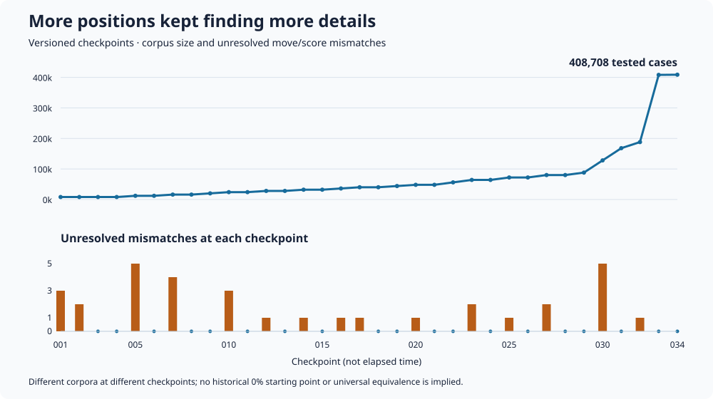

# Preservation validation summary

The research build matched the original DOS engine's **best move and reported
score** on 408,708 test cases. The final tested engine source was unchanged
during packaging. This repository contains a 100-case smoke subset, not the
full research corpus or original execution inputs, so it does not independently
reproduce the entire reported aggregate.

| Requested depth | Research cases | Matches | Reached requested depth |
| --- | ---: | ---: | ---: |
| 2–4 | 408,100 | 408,100 | Not separately summarized here |
| 5 | 288 | 288 | 287 |
| 6 | 288 | 288 | 285 |
| 7 | 32 | 32 | 31 |

The five deeper searches that stopped earlier returned normally; they were
not timeouts. The last three fresh shallow batches each contained 20,000 cases
and found no differences on an unchanged engine. The earlier 348,100 shallow
cases were replayed against that same final build. Full versus lean original
execution was cross-checked, including examples at depths 5, 6, and 7.

Inputs are seeded, randomized legal histories of 2–40 plies. Opening-book use
is disabled and depth is fixed. Counts are cases, not necessarily unique boards
or representative human games. Errors and incomplete emulation are not counted
as matches. Node counts, complete PVs, wall-clock behavior, arbitrary deeper
searches, and every possible endgame are outside the aggregate fidelity claim.

Different checkpoints use different corpora. This is not a fixed-benchmark
accuracy curve or a claim of starting at 0% fidelity.

## Strength is a different question

Earlier small match pilots against reduced-strength Pikafish suggested a
crossover near its 1400 setting; ElephantEye was substantially stronger in
the pilots. These experiments predate the final fidelity corrections, have
wide uncertainty, and were not rerun on the finished build. They are not an
official human Elo, or a measured rating of this final revision.

`cch-modern` changes the cache and is intentionally outside the preservation
match claim. More speed or strength does not establish more faithful behavior.

## Public reproduction

Build and run the C suite and 100-case replay as described in the README.
Only the portable executable is needed. The public release does not bundle
the original-program emulator harness or its initialized memory snapshot.
`PUBLIC_EXPORT.json` records the upstream revision and exported file hashes;
it is a provenance aid, not a third-party rights certification.
